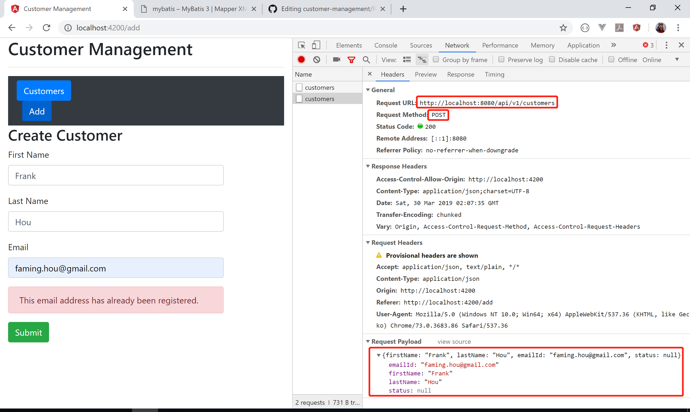
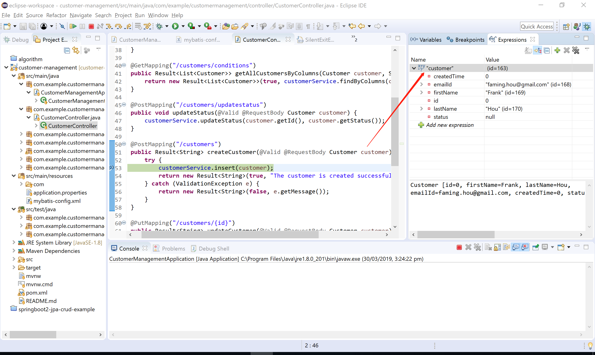

# Customer Management

## Overview

## Installation

### Prerequisites

* [Install npm](https://nodejs.org/en/)
* [Install Java 8](https://www.oracle.com/technetwork/java/javase/downloads/jdk8-downloads-2133151.html)
* [Install Visual Studio Code](https://code.visualstudio.com/download)
* [Install Eclipse](https://www.eclipse.org/downloads/)
* [Install Angular CLI](https://angular.io/guide/quickstart)
* [Install MySQL Community Server](https://dev.mysql.com/downloads/mysql/5.5.html)
* [Execute init.sql](mysql/init.sql)

### Frontend

* [Repository](https://github.com/FamingHou/customer-management-frontend)

* Download source code
```console
C:\project> git clone https://github.com/FamingHou/customer-management-frontend.git
C:\project> cd customer-management-frontend
C:\project\customer-management-frontend> npm install
```
* Start up
```console
C:\project\customer-management-frontend>ng serve
```
### Backend

* [Repository](https://github.com/FamingHou/customer-management-springboot)

1. Download source code
```console
C:\project> git clone https://github.com/FamingHou/customer-management-springboot
```
2. Import it as a maven existing project in Eclipse
3. Run the class *CustomerManagementApplication* as a Java application in Eclipse

## Frameworks

### Frontend

Framework | Version
------------- | -------------
Node.js | 10.13.0
Angular | 7.3.6
Typescript | 3.1.6

### Backend

Framework | Version
-------------------------- | --------------------------
Spring boot | 2.1.3
mybatis-spring-boot-starter | 1.3.0
spring-boot-starter-web
spring-boot-devtools
MyBatis | 3.5.1

## Restful APIs

Feature | Request URL | HTTP Method	 | Request parameter | Request body | Response status
---|---|---|---|---|---|
Create a customer | api/v1/customers | POST | | Customer | 201
Find all customers | api/v1/customers | GET | SortCriteria {sortColumn, sortDirection} | | 200
Find filtered customers | api/v1/customers/conditions | GET | Customer, SortCriteria || 200
Update a customer | api/v1/customers | PUT | | Customer | 200
Updata status of a customer | api/v1/customers/updatestatus | POST | | Customer | 200
Delete a customer | api/v1/customers/{id} | DELETE | | Id | 200

## Case study

### Create a customer

1. Do post from client



2. Data received by controller on the server side



3. Interface *CustomerService*

```java
public interface CustomerService {
  ...
  void insert(Customer customer) throws ValidationException;
  ...
}
```

4. Class *CustomerServiceImpl*

```java
@Service
public class CustomerServiceImpl implements CustomerService {
  ...
  @Override
  public void insert(Customer customer) throws ValidationException {
    Customer found = customerMapper.findByEmailId(customer);
    if (found != null) {
      throw new ValidationException("This email address has already been registered.");
    }
    customer.setCreatedTime(System.currentTimeMillis()); // Unix Timestamp in milliseconds
    customerMapper.insert(customer);
  }
  ...
}   
```

5. Interface *CustomerMapper*

```java
@Mapper
public interface CustomerMapper {
  ...
  void insert(Customer customer);
  ...
}
```

6. *CustomerMapper.xml*

```xml
<mapper namespace="com.example.customermanagement.mapper.CustomerMapper">
  ...
  <insert id="insert">
    insert into customer (first_name, last_name, email_address, status, created_time)
    values (#{firstName}, #{lastName}, #{emailId}, #{status}, #{createdTime})
  </insert>
  ...
</mapper>  
```

### Column name mismatches 

It is often the case that a property name of a java class is different from the corresponding column name of the table.  

```java
public class Customer implements Serializable{
    private static final long serialVersionUID = 1L;

    private long id;
    private String firstName;
    private String lastName;
    private String emailId;
    private long createdTime;
    private String status;
}
```

```sql
CREATE TABLE `customer` (
  `id` int(11) NOT NULL AUTO_INCREMENT,
  `first_name` varchar(45) NOT NULL,
  `last_name` varchar(45) NOT NULL,
  `email_address` varchar(45) NOT NULL,
  `status` varchar(45) DEFAULT NULL,
  `created_time` bigint(20) DEFAULT NULL,
  PRIMARY KEY (`id`)
) ENGINE=InnoDB AUTO_INCREMENT=6 DEFAULT CHARSET=utf8;

```

In above case, we can only get the value of *id* if we use the default search method. MyBatis uses [ResultMap](http://www.mybatis.org/mybatis-3/sqlmap-xml.html) to solve this problem.

```xml
  <resultMap id="customerResultMap" type="Customer">
    <id property="id" column="id" />
    <result property="firstName" column="first_name" />
    <result property="lastName" column="last_name" />
    <result property="emailId" column="email_address" />
    <result property="createdTime" column="created_time" />
    <result property="status" column="status" />
  </resultMap>
```

### UNIX Epoch time

The customer was created at GMT: Saturday, March 30, 2019 4:15:20 AM, and Auckland Time: March 30, 2019 5:15:20.653 PM GMT+13:00 DST. The value of created_time on MySQL was saved as UNIX Epoch time by using *System.currentTimeMillis()*.

```json
  {
    "id": 1,
    "first_name": "Frank",
    "last_name": "Hou",
    "email_address": "faming.hou@gmail.com",
    "status": "current",
    "created_time": 1553919320653
  }
```  

[DatePipe](https://angular.io/api/common/DatePipe) is used to format the date value.

```typescript
  <td>{{customer.createdTime | date : "dd/MMM/yyyy HH:mm:ss"}}</td>
```
It is displayed as *30/Mar/2019 17:15:20* according to locale rules.

